# E-Voting Portal

## Overview

The E-Voting Portal is a secure and user-friendly web application designed to facilitate online elections. This system aims to streamline the voting process, allowing registered users to cast their votes conveniently and transparently from anywhere. It supports various user roles, including voters, candidates, and administrators, ensuring a comprehensive election management system.

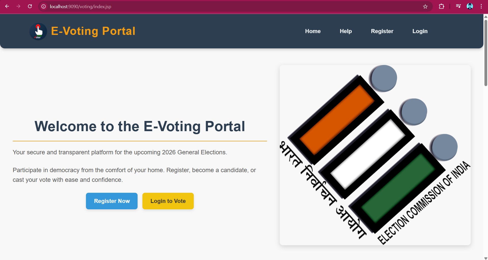

## Features

**User Registration & Login**: Secure authentication for voters, candidates, and administrators.

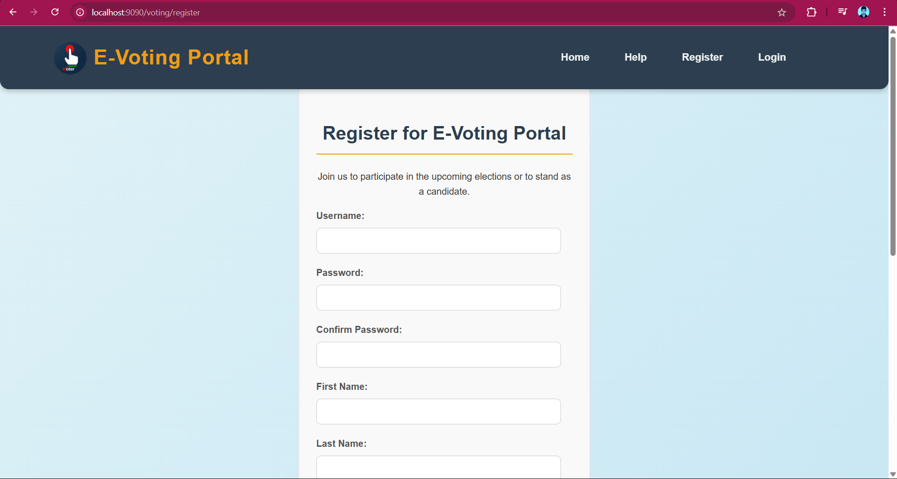

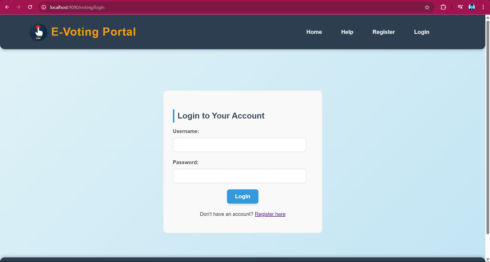

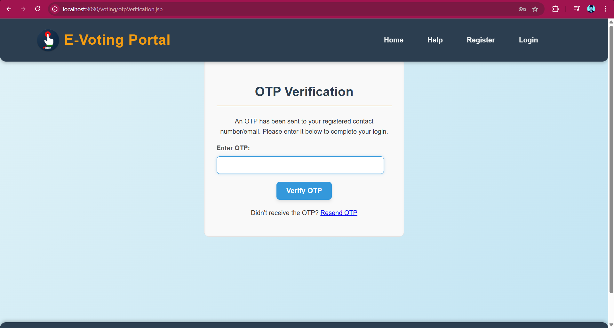

**Role-Based Access Control**: Distinct functionalities and dashboards tailored to different user roles (Admin, Voter, Candidate).

**Voter Management**: Administrators can manage voter details, including registration approval/rejection.

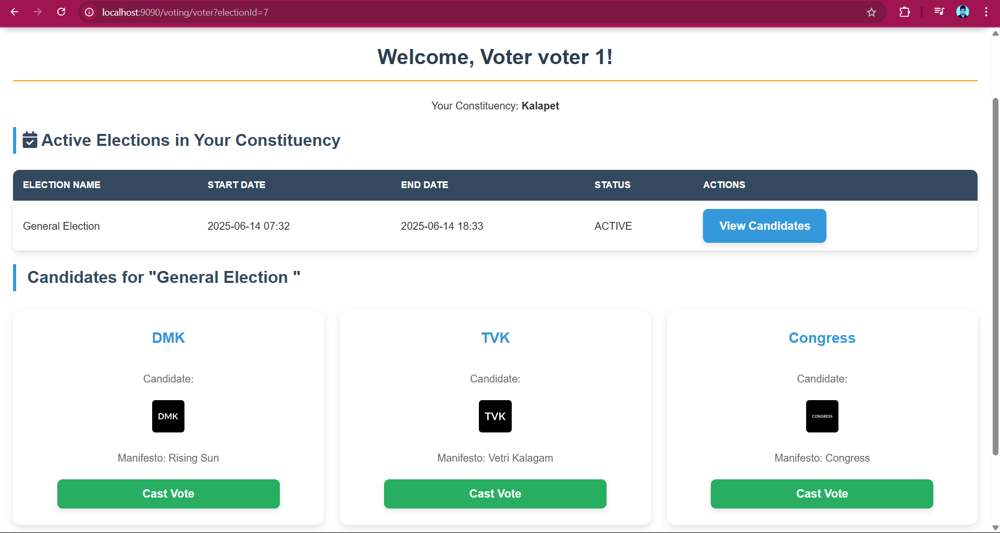

**Candidate Management**: Administrators and candidates can manage candidate profiles and manifestos.

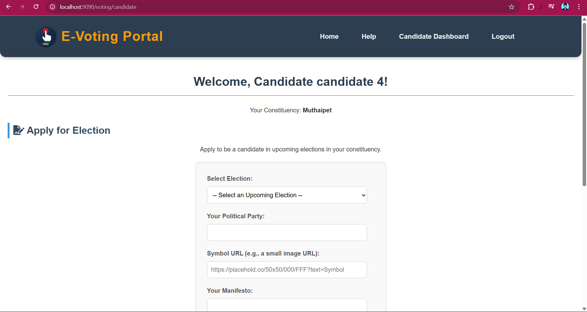

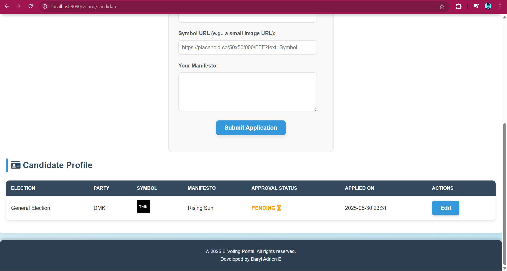

**Election Management**: Administrators can create, configure, start, and end elections.

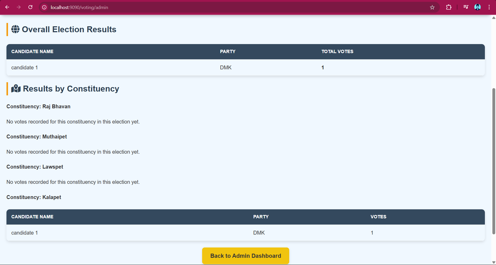

**Secure Voting**: Registered voters can cast their votes in active elections.

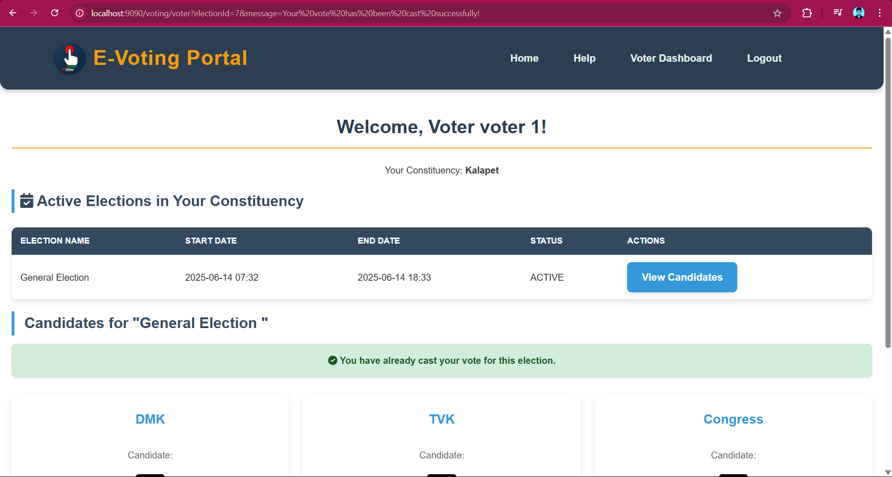

**Real-time Results (Admin View)**: Administrators can view live election results.

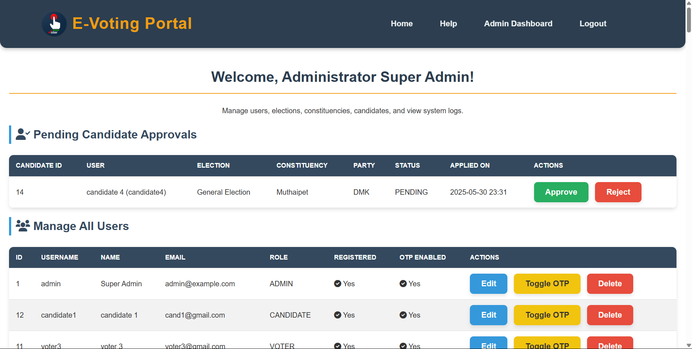

**Public Election Summary**: Display of upcoming elections and recent results on the homepage 

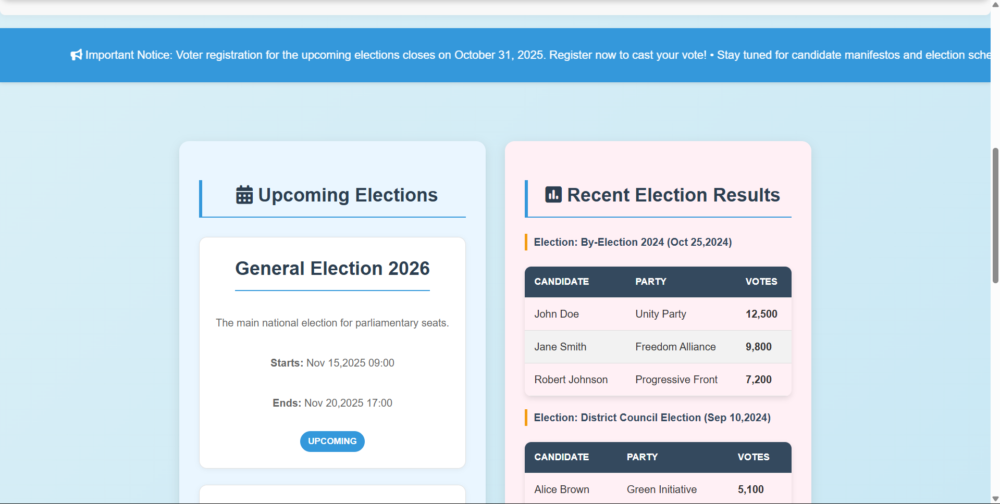

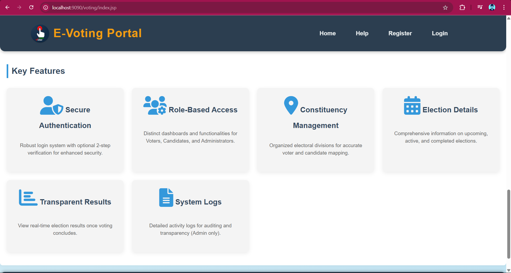

## Technologies Used

### Frontend:

JSP (JavaServer Pages): For dynamic web content generation and presentation.
HTML5, CSS3, JavaScript: For structuring, styling, and interactivity.
JSTL (JSP Standard Tag Library): For simplifying JSP development.
Font Awesome: For icons.

### Backend:

Java Servlets: For handling HTTP requests and business logic.
JDBC (Java Database Connectivity): For database interaction.

### Database:

Oracle Database: Used for storing all application data (users, elections, candidates, votes, etc.).

### Server:

Apache Tomcat: The web server and servlet container for deploying the application.

### Build Tool (Implicit):

Apache Maven / Apache Ant (or Eclipse Built-in): While not explicitly mentioned, typically used for project structure, dependency management, and building WAR files. (You can specify if you used Maven or Ant).

## Setup and Installation

Follow these steps to get the E-Voting Portal up and running on your local machine.

### Prerequisites

    **Java Development Kit (JDK)**: Version 8 or higher (e.g., JDK 8, JDK 11).
    
    **Apache Tomcat**: Version 7.0.x or higher (e.g., Tomcat 9.x, Tomcat 10.x recommended for newer JDKs).
    **Oracle Database**: An accessible Oracle instance (e.g., Oracle XE, or a full instance).
    **SQL Developer / SQL*Plus**: For database schema setup.
    **IDE (Integrated Development Environment)**: Eclipse IDE for Enterprise Java and Web Developers recommended.
    Database Setup
    **Connect to Oracle**: Use SQL Developer or SQL*Plus to connect to your Oracle database instance.
    **Create User (Optional but Recommended)**: Create a dedicated user for the application (e.g., EVOTING_USER).

## SQL

CREATE USER EVOTING_USER IDENTIFIED BY your_password;
GRANT CONNECT, RESOURCE, CREATE VIEW TO EVOTING_USER;
GRANT UNLIMITED TABLESPACE TO EVOTING_USER; -- For simplicity, adjust permissions as needed

Run Schema Script: Execute the SQL script (you'll need to create this) to set up the necessary tables (e.g., users, elections, candidates, votes, constituencies, etc.).

Note: You will need to create schema.sql (or similar) file with your table creation DDL.

**Example (Conceptual)**:

SQL

-- Create USERS table
CREATE TABLE users (
    user_id NUMBER GENERATED BY DEFAULT ON NULL AS IDENTITY PRIMARY KEY,
    username VARCHAR2(50) NOT NULL UNIQUE,
    password VARCHAR2(255) NOT NULL,
    email VARCHAR2(100) UNIQUE,
    role VARCHAR2(20) DEFAULT 'voter' NOT NULL, -- 'admin', 'voter', 'candidate'
    status VARCHAR2(20) DEFAULT 'pending' NOT NULL -- 'pending', 'approved', 'rejected'
);

-- Create ELECTIONS table
CREATE TABLE elections (
    election_id NUMBER GENERATED BY DEFAULT ON NULL AS IDENTITY PRIMARY KEY,
    name VARCHAR2(100) NOT NULL,
    description VARCHAR2(500),
    start_date TIMESTAMP NOT NULL,
    end_date TIMESTAMP NOT NULL,
    status VARCHAR2(20) DEFAULT 'upcoming' NOT NULL -- 'upcoming', 'active', 'completed', 'cancelled'
);

-- Add other tables like CANDIDATES, VOTES, CONSTITUENCIES etc.
Configure DBConnection.java: Update your database connection utility (com.evoting.util.DBConnection or similar) with your Oracle database URL, username, and password.
Java

// Example snippet (adjust according to your actual DBConnection class)
private static final String JDBC_URL = "jdbc:oracle:thin:@localhost:1521:XE"; // Or your service name/SID
private static final String DB_USER = "EVOTING_USER";
private static final String DB_PASSWORD = "your_password";

### Add Oracle JDBC Driver:

Download the ojdbcX.jar (e.g., ojdbc8.jar for Java 8) compatible with your Oracle version.
Place this JAR file in your Tomcat's lib directory (e.g., apache-tomcat-X.X.X/lib/). This makes the driver available to all web applications deployed on that Tomcat instance.
Alternatively, if using Maven, ensure the dependency is correctly configured in your pom.xml:

XML

<dependency>
    <groupId>com.oracle.database.jdbc</groupId>
    <artifactId>ojdbc8</artifactId>
    <version>12.2.0.1</version> </dependency>

## Application Deployment

Clone the Repository:

            git clone https://github.com/DarylAdrien/Advanced_java_programming.git
            cd E_Voting_Portal

Import into Eclipse:

Open Eclipse.
Go to File > Import... > Maven > Existing Maven Projects (if using Maven) or General > Existing Projects into Workspace.
Browse to the cloned e-voting-portal directory and select it.
Click Finish.

Configure Tomcat in Eclipse:

In the Servers view (Window > Show View > Servers), create a new Tomcat server if you haven't already.
Point it to your Apache Tomcat installation directory.
Add the e-voting-portal project to this Tomcat server.

Clean and Build:

Right-click on your project in Eclipse's Package Explorer.
Select Maven > Update Project... (if using Maven) or Project > Clean....
Ensure there are no build errors.

Start Tomcat:

In the Servers view, right-click on your configured Tomcat server.
Select Start.
Usage
Open your web browser.
Navigate to http://localhost:8080/e-voting-portal/ (or whatever context path you have configured).

Register: Create a new voter account through the registration page.

Admin Access: To access the admin panel, you'll likely need to manually update a user's role in the database to 'admin' initially.

SQL

UPDATE users SET role = 'admin', status = 'approved' WHERE username = 'your_admin_username';
COMMIT;

Explore the different functionalities as a voter, candidate, or administrator.

## Contribution

Feel free to fork this repository, make improvements, and submit pull requests.

## License

This project is licensed under the MIT License.
